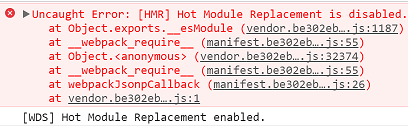
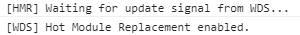

# Basic Application
This application was developed during a Webpack training video I watched.
The video is called Webpack for React Applications was on Safari Online Books.
 https://www.safaribooksonline.com/library/view/webpack-for-react/9781788472203/video2_1.html
 
The author said to use webpack 2.6.1

    yarn add webpack@2.6.1 -D

Other packages are

    yarn add babel-loader babel-preset-es2015 babel-preset-react -D
    yarn add babel-core -D
    yarn add react react-dom
    // The version used was v0.27.5 
    
    
After the basics were working these were installed

    yarn add css-loader -D
    yarn add file-loader -D
    yarn add image-webpack-loader -D

After adding CSS and seeing it not work, he added style-loader

    yarn add style-loader -D

To use SASS the following was needed

    yarn add sass-loader node-sass -D

    yarn add http-server -D

    yarn add html-webpack-plugin -D

# Video shows

## How to setup basic webpack

## How to add React

## How to add CSS

## How to add watching to auto recompile/package

## How to add images

## How to use SASS or CSS

## Adding an HTTP Server to support React-Router
To use SASS the following was needed

    yarn add http-server -D
   
To run it, the package.json file was updated.  The scripts section

## Add HTML Webpack Plugin
This plugin allows you to specify the HTML page that will be served
as the single page app and the plugin with "behind the scenes" add
an "include" for the bundle.js file.

    yarn add html-webpack-plugin -D

See https://github.com/jantimon/html-webpack-plugin.

Next update the webpack.config.js file

## Packging your app into vendor.js and bundle.js
This is done to speed up the loading of your application because on subsequent
visits to the page, the vendor.js file (which is constant) will
already be cached.
But this steps is only a partial step and the next one is also needed.

The following changes were made to the webpack.config.js file.

    // entry: APP_DIR + '/app.js',
    entry: {
        bundle: APP_DIR + '/index.js',
        vendor: VENDOR_LIBS
    }
    output: {
        path: BUIILD_DIR,
        filename: '[name].js'
    },

When I ran yarn run dev I got this output...

                               Asset       Size  Chunks                    Chunk Names
    3c2f0cf1c629df7079ed7d7c7734f847.jpg    29.9 kB          [emitted]
                               vendor.js    2.34 MB       0  [emitted]  [big]  vendor
                               bundle.js    56.3 kB       1  [emitted]         bundle
                             manifest.js    5.94 kB       2  [emitted]         manifest
                              index.html  337 bytes          [emitted]

So you can see the vendor.js file is now around 2.34MB but the bundle.js file
is now fairly small, and so is the manifest.js file.

## Cache Busting
The following shows how to tell webpack to create filenames with a unique
hash name included so the browser will not use previously loaded
code.

## How to clean up the distribution directory
Using package called rimraf.

    yarn add rimraf -D

Update the package.json file

    "scripts": {
      "clean": "rimraf dist",

After those changes you can clean up the dist directory by running:

    npm run clean

## Switching from http-server to WebPack DevServer

    yarn add webpack-dev-server -D

By running Webpack Dev Server you get hot module reloading 
automatically!  
 
## Enabling Hot Module Reloading

- Enable Hot Module Reloading on DevServer
    devServer: {
    // . . .
        hot: true

This produces an Uncaught Error: [HMR] Hot Module Replacement is disabled.
error message.

To fix that error you need to add a plugin 

- Added HotModuleReplacementPlugin to webpack config plugins section 

    plugins: [
        // . . .
        new webpack.HotModuleReplacementPlugin()
    ],

But when building webpack compiler reports an error

    ERROR in chunk manifest [entry]
    [name].[chunkhash].js
    Cannot use [chunkhash] for chunk in '[name].[chunkhash].js' (use [hash] instead)

To fix that error you need to change [chunkhash] to hash

- Changed [hashchunk]

    output: {
        path: BUILD_DIR,
        filename: '[name].[hash].js'
    },

Note that when going to production you might want to use [chunkhash]
but for developmentment [hash] is the best way to go.

## Lazy Loading

    yarn add babel-plugin-syntax-dynamic-import -D
    yarn add react-loadable

Changing webpack.config.js as follows.  It was this:

     test: /\.(js|jsx)$/,
     exclude: /node_modules/,
     use: 'babel-loader'
 
And it was changed to:

    test: /\.(js|jsx)$/,
    exclude: /node_modules/,
    loader: 'babel-loader',
    options: {
        babelrc: false,
        presets: ["babel-preset-env", "react", "stage-2"],
        plugins: ['syntax-dynamic-import']
    }

I needed to add the missing packages

    yarn add babel-preset-env -D
    yarn add babel-preset-stage-2 -D

# What my webpack.config.js file looks like
[webpack.config.js](./webpack.config.js)

